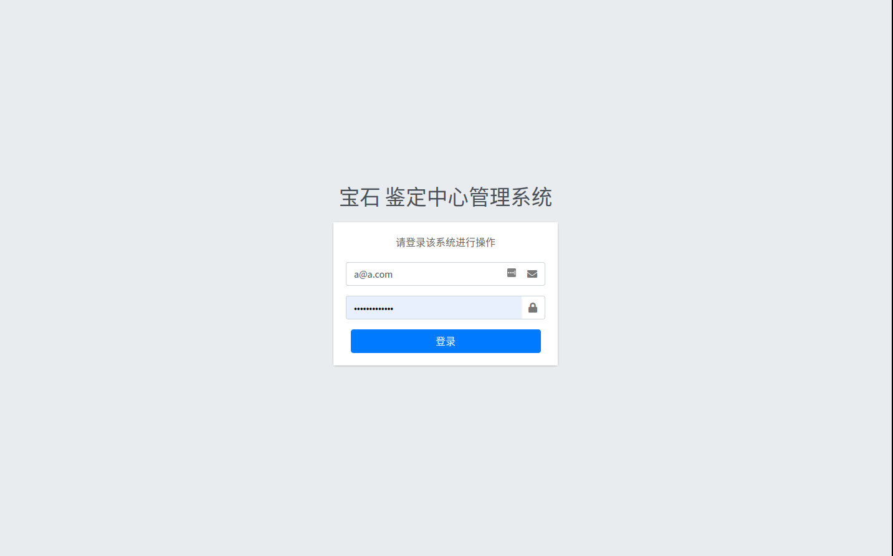
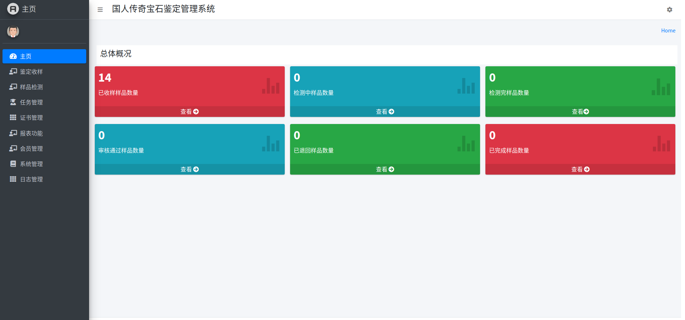
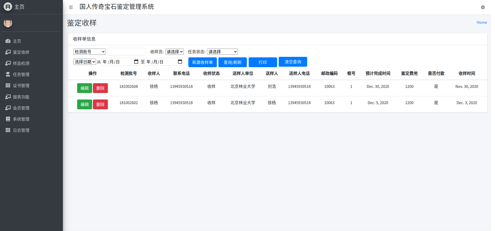
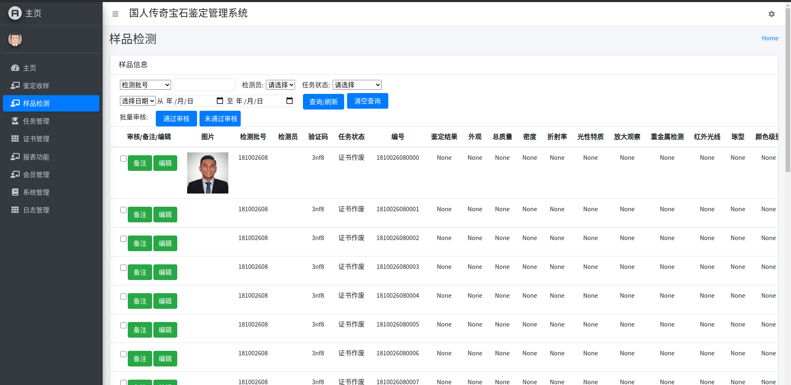
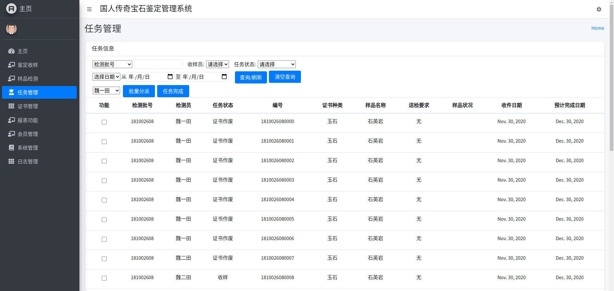
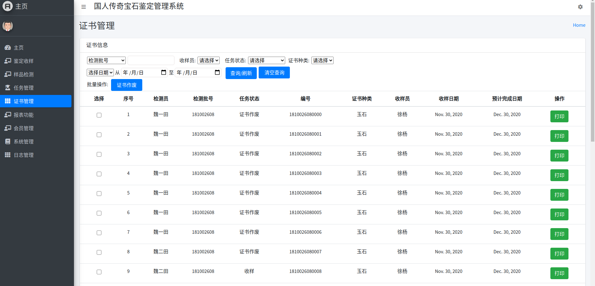
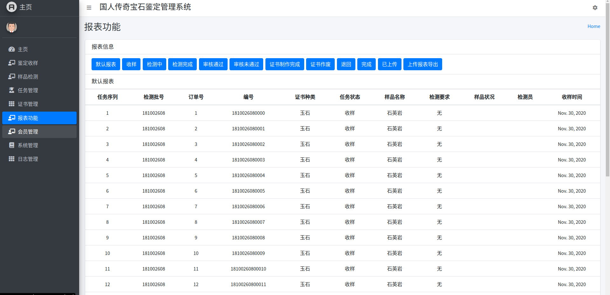
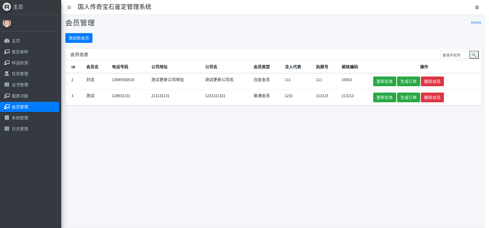
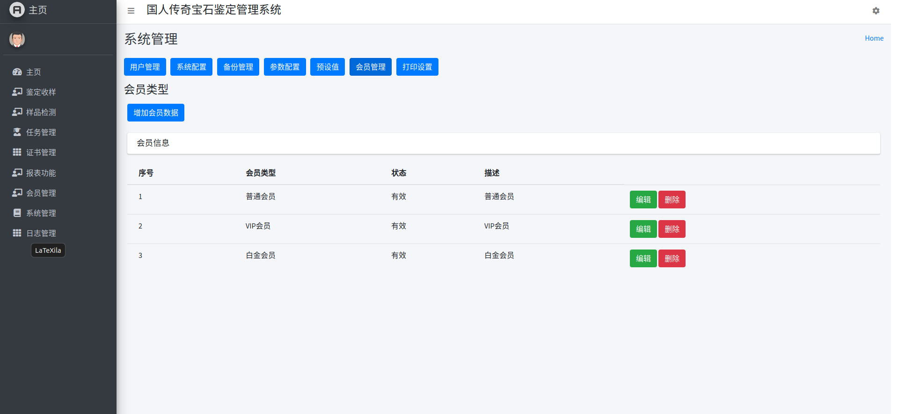

# 国人传奇宝石鉴定中心业务管理系统


成员：连月菡 徐杨 张浩天 费蝶 王军辉

[TOC]

### 项目背景

本次项目为受委托单位（国人传奇宝石鉴定中心）委托，为其开发一个用于线上信息录入、管理的专属网页。该中心主要从事宝石鉴定业务，在网页功能方面需要实现主页信息总汇、鉴定收样情况显示、样品检测情况显示、任务管理、证书管理、报表功能、会员管理、系统管理和日志管理等功能。希望通过该系统对公司鉴定工作进行规范化管理和信息精准录入，达到提高工作效率的最终目的。详情如下：

项目的委托单位:国人传奇宝石鉴定中心

开发单位: 北京林业大学信息学院计创18班徐杨组

主管部门: 北京林业大学信息学院

项目名称: 国人传奇宝石鉴定中心业务管理系统

项目用户:国人传奇宝石鉴定中心


### 功能概述

| 功能模块     | 实现功能                                                     |
| ------------ | ------------------------------------------------------------ |
| 鉴定收样模块 | 新建收样单，添加检验室信息、收样人信息、样品信息和内部信息   |
| 样品检测模块 | 添加样品检测值，编辑检测项目图片及备注信息，最后填写审核结果 |
| 任务管理模块 | 将宝石鉴定的订单指派给不同的检测员，可以实现单个分派操作和批量分派操作，同时收样员可以在本页选择以及成功领件的任务，使其变成任务完成状态。 |
| 证书管理模块 | 按照一定的筛选条件查询证书信息, 		使证书作废, 		打印输出证书信息。 |
| 报表功能模块 | 根据报表的不同状态进行查询，同时可以将查询结果上传至网站。   |
| 会员管理模块 | 添加新会员信息， 		更新或删除已有的会员信息, 		 选中会员点击生成订单转至鉴定收样页创建新订单。 |
| 系统管理模块 | 设置管理员分组，并授予不同分组不同的管理权限。进行全局系统设置。设定不同会员等级。 |

### 使用方法

- ​	数据库：SQLite Version 3.33.0
- ​	开发工具包：Django Version 3.1.3
- ​	开发环境：PyCharm Version 2020.2.3

1. 安装包

```
pip install xlwt
```

2. 创建超级管理员账号

```
python manage.py createsuperuser
```

3. 在本地服务器上运行

```
python manage.py runserver
```


### 界面展示

1. 登录



2. 主页



3. 鉴定收样



4. 样品检测



5. 任务管理



6. 证书管理



7. 报表功能



8. 会员管理



9. 系统管理



### 参考资料

《软件工程导论》，张海藩（第五版），清华大学出版社； 

《软件工程及软件开发应用》，施一萍，清华大学出版社； 

《面向对象分析与设计（UML）》，陈志泊 清华大学出版社；